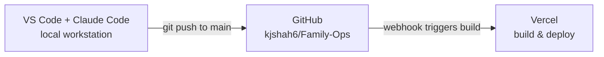
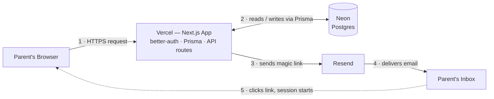

# Architecture

Cubby runs on two pipelines: one moves a code change from the editor
into production, the other moves a parent from typing their email to a
signed-in session.

A polished, blueprint-styled version of these diagrams is published here:
https://claude.ai/code/artifact/900d8b43-91bb-46d6-b85c-53e625f3d35f

## 1. Build & deploy pipeline

Every push to `main` triggers a Vercel build automatically — there's no
manual deploy step once this is wired up.

## 2. Runtime & sign-in flow

Sign-in has no password: Vercel emails a one-time link through Resend, and
opening it in the inbox is the action that authenticates the browser.

## Stack

| Layer | Tool |
|---|---|
| Editor / agent | VS Code + Claude Code |
| Source control | GitHub (`kjshah6/Family-Ops`) |
| Hosting / deploy | Vercel |
| Database | Neon (Postgres) |
| Email delivery | Resend |
| App framework | Next.js (App Router) |
| ORM | Prisma |
| Auth | better-auth (email magic link + passkeys) |
